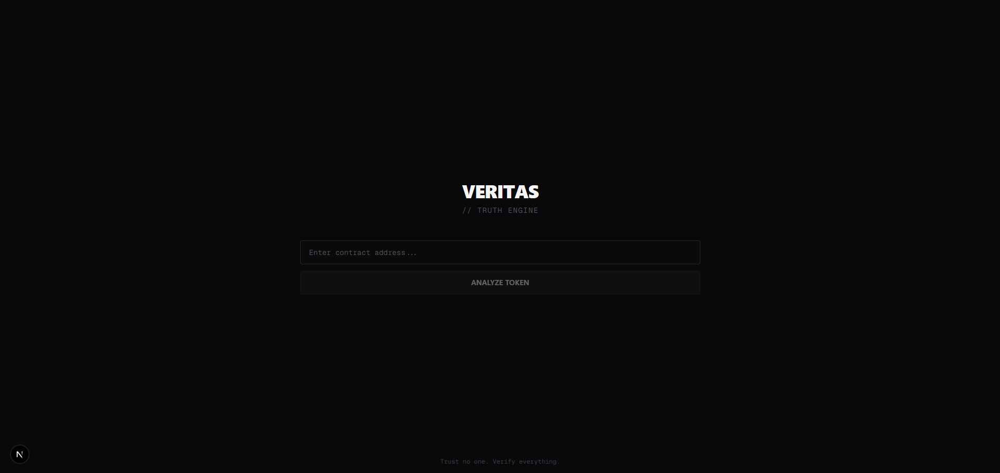

# VERITAS

> **Trust no one. Verify everything.**

AI-powered crypto scam detection for TON, built with Google Gemini 3.



## 🎯 What It Does

Paste any TON token address → Get an instant AI verdict on whether it's safe or a scam.

**VERITAS analyzes:**

- 📊 On-chain data (liquidity, market cap, volume, token age)
- 🔍 Contract risks (TON Security audit score)
- 📸 Visual evidence (website & Twitter screenshots)
- 🧠 AI reasoning (Gemini 3 multimodal analysis)

## ✨ Key Features

### 🐘 Elephant Memory

Known scammer deployers are instantly blocked. Once flagged, any new token from that wallet triggers an **INSTANT BLOCK** in milliseconds.

### 🧠 Multimodal AI Analysis

Gemini 3 analyzes text data AND screenshots simultaneously, detecting lies like:

- "LP Locked" but contract audit shows unlocked
- "Active community" but Twitter is deleted
- Claims vs. reality mismatches

### 🎭 Identity-Aware Judgments

Veritas knows the difference:

- **Meme Coins** → Judged on vibes, community, art
- **Utility Tokens** → Judged on professionalism, execution

### ⚡ Context-Aware Rules

- New tokens (< 2 hours) with low LP = normal, not red flag
- Old tokens (> 1 month) with $10M+ MC = survived the rug test
- Guest Blindness: Ignores Twitter login walls

## 🏗️ Architecture

```
┌─────────────────────────────────────────────────────────────────┐
│                         USER INPUT                               │
│                    (TON Token Address)                        │
└────────────────────────────┬────────────────────────────────────┘
                             │
                             ▼
┌─────────────────────────────────────────────────────────────────┐
│                      ELEPHANT MEMORY                             │
│              MongoDB - Known Scammer Database                    │
│    ┌──────────────────────────────────────────────────────┐     │
│    │  Check deployer → Match? → INSTANT BLOCK (5ms)       │     │
│    └──────────────────────────────────────────────────────┘     │
└────────────────────────────┬────────────────────────────────────┘
                             │ (No match)
                             ▼
┌─────────────────────────────────────────────────────────────────┐
│                       TRUTH ENGINE                               │
│              Parallel Data Aggregation                           │
│  ┌──────────────┐  ┌──────────────┐  ┌──────────────┐          │
│  │ GeckoTerminal│  │ TON Security  │  │   Microlink  │          │
│  │  Market Data │  │ Contract Audit│  │  Screenshots │          │
│  └──────────────┘  └──────────────┘  └──────────────┘          │
└────────────────────────────┬────────────────────────────────────┘
                             │
                             ▼
┌─────────────────────────────────────────────────────────────────┐
│                       VERITAS AI                                 │
│                   Gemini 3 Multimodal                            │
│  ┌──────────────────────────────────────────────────────────┐   │
│  │  System Prompt (Degen Brain)                             │   │
│  │  + On-chain data                                         │   │
│  │  + TON Security / contract risks                         │   │
│  │  + Website screenshot (vision)                           │   │
│  │  + Twitter screenshot (vision)                           │   │
│  │  = VERDICT + ANALYSIS                                    │   │
│  └──────────────────────────────────────────────────────────┘   │
└────────────────────────────┬────────────────────────────────────┘
                             │
                             ▼
┌─────────────────────────────────────────────────────────────────┐
│                        OUTPUT                                    │
│  ┌──────────┐  ┌─────────────────────────────────────────────┐  │
│  │  VERDICT │  │  SAFE | CAUTION | DANGER | SCAM             │  │
│  └──────────┘  └─────────────────────────────────────────────┘  │
│  ┌──────────┐  ┌─────────────────────────────────────────────┐  │
│  │ HEADLINE │  │  "This whale is swimming in clean water"    │  │
│  └──────────┘  └─────────────────────────────────────────────┘  │
│  ┌──────────┐  ┌─────────────────────────────────────────────┐  │
│  │  DEGEN   │  │  "Clean code. Ape with confidence. 🦧💎"   │  │
│  │ COMMENT  │  └─────────────────────────────────────────────┘  │
│  └──────────┘                                                   │
└─────────────────────────────────────────────────────────────────┘
```

## 🛠️ Tech Stack

| Layer    | Technology                                   |
| -------- | -------------------------------------------- |
| AI       | **Google Gemini 3** (gemini-3-flash-preview) |
| Frontend | Next.js 16, React, TypeScript                |
| Styling  | Tailwind CSS                                 |
| Database | MongoDB Atlas (Elephant Memory)              |
| APIs     | GeckoTerminal, TON Security, Microlink       |

## 🚀 Getting Started

### Prerequisites

- Node.js 18+
- Gemini API key
- MongoDB Atlas URI (optional, for Elephant Memory)

### Installation

```bash
# Clone the repo
git clone https://github.com/yourusername/veritas.git
cd veritas

# Install dependencies
npm install

# Set up environment
cp .env.example .env.local
# Add your GEMINI_API_KEY and MONGODB_URI

# Run development server
npm run dev
```

### Environment Variables

```env
GEMINI_API_KEY=your_gemini_api_key
MONGODB_URI=your_mongodb_connection_string
```

## 📁 Project Structure

```
src/
├── app/
│   ├── page.tsx              # Main UI
│   └── api/scan/route.ts     # Scan API endpoint
├── components/
│   ├── truth/TruthConsole.tsx    # Scanner UI
│   └── ui/CryptoLoader.tsx       # Loading animation
├── lib/
│   ├── ai/veritas.ts         # Gemini AI logic
│   ├── api/
│   │   ├── truth.ts          # Data aggregation
│   │   ├── market.ts         # DexScreener
│   │   └── tonsecurity.ts    # Contract audit (TON)
│   └── db/
│       ├── mongodb.ts        # DB connection
│       └── elephant.ts       # Scammer database
```

## 🎬 Demo

[Watch the demo video](https://youtube.com/your-demo-link)

## 📝 Gemini 3 Integration

Veritas uses **Gemini 3 Flash** (`gemini-3-flash-preview`) for:

1. **Multimodal Analysis** - Processes text data AND images simultaneously
2. **Vision AI** - Analyzes website and Twitter screenshots for red flags
3. **Contextual Reasoning** - Applies crypto-specific knowledge to detect scams
4. **Structured Output** - Returns JSON verdicts for consistent UI rendering

**Key Gemini 3 Features Used:**

- Multimodal input (text + images)
- System prompts for persona (Degen Brain)
- Low temperature (0.3) for consistent judgments
- Large context window for comprehensive analysis

## 🏆 Hackathon

Built for the **Google Gemini 3 Hackathon** (December 2025 - February 2026)

## 📄 License

MIT

---

**VERITAS** - _Trust no one. Verify everything._
