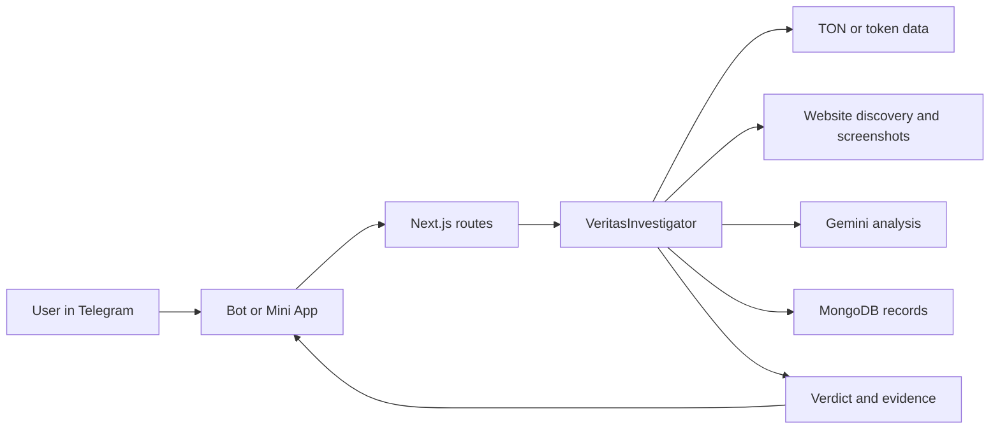

# Veritas
Telegram-native TON trust investigation for website claims, token truth, website drift, and repeated trust-abuse patterns.

## Problem
TON tokens are often discovered inside Telegram through links, screenshots, landing pages, and social posts before a user ever reads the contract.

Most token checks stop at token mechanics. They can tell you about mint authority, holder concentration, or liquidity, but they usually miss the trust surface that actually sells the token:

- fake or unsupported website claims
- trust badges and partnership language
- quiet website changes after launch
- repeated website and claim patterns across prior risky launches

That leaves a gap between what a project says and what the token and its history actually support.

## What Veritas Does
- Claims check: extract website trust claims and mark them as verified, unverified, contradicted, or unknown.
- Website truth vs token truth: compare what the site says against on-chain token controls and available source data.
- Website drift: compare the current site against prior Veritas snapshots when available.
- Repeated trust-abuse patterns: surface repeated domains, repeated unsupported claim motifs, and similar prior patterns in Veritas records.
- Authority-linked prior scan history: show prior launches linked to the same mint or freeze authority when records exist.

## Why This Matters on TON
TON distribution is deeply Telegram-native. Users are often one tap away from a landing page and one paste away from a token.

That makes website and social trust surfaces unusually important. If the website is deceptive, stale, or quietly changing, a contract-only check is not enough.

## Product Surface
Veritas has two user-facing surfaces:

- Telegram bot: paste a TON jetton address and get a verdict card, reasons, and optional follow-up sections for claims, drift, reputation, and authority history.
- Telegram Mini App: paste the same address and get a fast on-chain and market view first, then the full trust investigation once the slower analysis completes.

In both surfaces, the user is not just told a verdict. They are shown why: website claims, site status, drift, repeated patterns, and prior authority-linked history where available.

## Honest Limits
- Authority history is keyed from mint or freeze authority. That address is not guaranteed to be the original deployer.
- Website discovery depends on current token metadata and, in the Mini App, an optional user-provided website override.
- Repeated patterns are signals, not proof of coordination or fraud.
- Historical verdicts are historical scan outputs, not current truth.
- History-backed features depend on stored Veritas records. Without MongoDB, live analysis still works, but drift, prior-pattern checks, and authority history are limited.
- Visual evidence depends on whether a real project website is available and screenshot capture succeeds.

## Demo / Usage
### 1. Install
```bash
npm install
```

### 2. Configure environment
Copy `.env.example` to `.env.local` and set the values you need.

Required:

- `GEMINI_API_KEY`
- `TELEGRAM_BOT_TOKEN`

Recommended for the full product surface:

- `MONGODB_URI` for prior records, drift, and repeated-pattern detection
- `TELEGRAM_WEBHOOK_SECRET` for webhook verification
- `VERITAS_SAVE_SCREENSHOTS=true`
- `VERITAS_PUBLIC_BASE_URL=https://your-app.vercel.app`
- `SCREENSHOTONE_ACCESS_KEY`

Notes:

- Screenshot-backed Telegram photo replies require `VERITAS_SAVE_SCREENSHOTS=true` and a public base URL.
- `SCREENSHOTONE_ACCESS_KEY` is optional; Veritas can fall back to Microlink, but screenshot capture is still website-dependent.

### 3. Run locally
```bash
npm run dev
```

This starts the Next.js app and the API routes used by the Mini App and bot webhook.

### 4. Configure the Telegram bot webhook
Deploy the app to a public URL, then point your bot webhook to:

```text
https://your-app.vercel.app/api/telegram/webhook
```

If you use `TELEGRAM_WEBHOOK_SECRET`, set the same secret when configuring the webhook.

### 5. Important runtime note
The core scan routes, `/api/analyze-fast` and `/api/analyze-unified`, are Telegram-gated. They expect valid Telegram Mini App init data in the `x-telegram-init-data` header.

In practice, that means the real scan flow is intended to run through Telegram, not as an open public browser form.

## Architecture

```mermaid
flowchart LR
  user[User in Telegram] --> surface[Bot or Mini App]
  surface --> routes[Next.js routes]
  routes --> investigator[VeritasInvestigator]
  investigator --> ton[TON or token data]
  investigator --> web[Website discovery and screenshots]
  investigator --> ai[Gemini analysis]
  investigator --> mongo[MongoDB records]
  investigator --> result[Verdict and evidence]
  result --> surface
```

Main routes:

- `/api/telegram/webhook`
- `/api/analyze-fast`
- `/api/analyze-unified`

## Repo Structure
- `src/lib/services/VeritasInvestigator.ts` - main investigation pipeline
- `src/app/api/telegram/webhook/route.ts` - Telegram bot entrypoint
- `src/components/truth/TruthConsole.tsx` - Mini App interface
- `src/lib/db/elephant.ts` - stored records for history, drift, and repeated-pattern checks

## Submission Note
Veritas is a Track 2 Telegram-native TON trust investigation product. Its focus is not generic token scoring. Its focus is checking whether a project's website story is supported by token truth and prior Veritas records.
